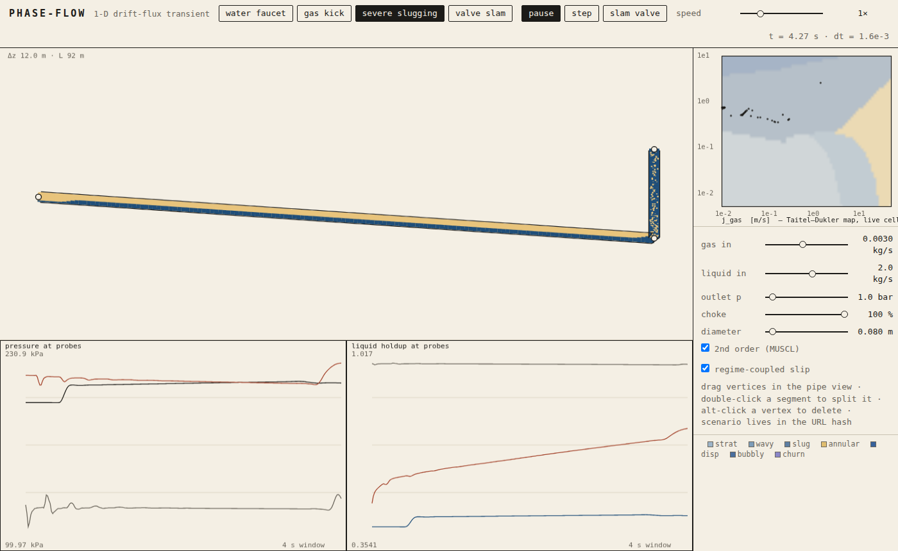

# phase-flow

[](https://github.com/benettia/PhaseFlow/actions/workflows/ci.yml)
[](https://github.com/benettia/PhaseFlow/actions/workflows/deploy.yml)

**▶ Play with it live: [benettia.github.io/PhaseFlow](https://benettia.github.io/PhaseFlow/)**

**A transient multiphase pipe flow simulator that runs live in the browser.**
Gas and liquid flow through a pipe you draw, solved by a real 1-D drift-flux
model — the same class of model that OLGA and nuclear thermal-hydraulics codes
run, small enough to be honest. Draw a dip before a riser, set low rates, and
watch the system discover severe slugging by itself: the four-stage limit
cycle (buildup → production → blowout → fallback) emerges from the equations,
not from scripting.



The heavy math is Rust (compiled to WebAssembly for the browser and to a
native extension for Python); the panel is plain ES modules + canvas; the
verification and analysis tooling is Python under `uv`.

---

## Quickstart

```sh
# 1. web app: build the wasm pkg once, then serve statically
wasm-pack build crates/wasm --target web --release --out-dir ../../web/pkg
python3 -m http.server -d web 8000        # → http://localhost:8000

# 2. solver test suite (fast: unit invariants + acceptance)
cargo test -p phase-core --release

# 3. python env — builds the maturin bindings and pulls analysis deps
uv sync

# 4. full verification suite (plots + assertions, ~1 min)
uv run pytest
```

Prerequisites: Rust stable with the `wasm32-unknown-unknown` target,
[`wasm-pack`](https://rustwasm.github.io/wasm-pack/), [`uv`](https://docs.astral.sh/uv/).
Zero runtime deps in the web app; Playwright (via uv) is the one browser dev-dep.

## Repository layout

| path | what | notes |
| --- | --- | --- |
| `crates/core` | the solver | `#![forbid(unsafe_code)]`, **zero dependencies**, f64 everywhere, no `mul_add` |
| `crates/scenario` | JSON ⇄ `Scenario` | serde lives here so core stays dep-free; shared by both wrappers |
| `crates/wasm` | wasm-bindgen wrapper | `new WasmSim(scenario_json)`, `step(dt_ms)`, `Float64Array` views straight into wasm memory (no copies) |
| `bindings/python` | pyo3 + maturin | `import phase_flow` → `Sim.from_json(...)`, numpy arrays out (safe copies, never aliased mutable), typed `.pyi` stubs |
| `web/` | index.html + canvas + controls | no framework, no bundler beyond wasm-pack output |
| `analysis/` | uv-run Python | verification plots, convergence studies, cycle analysis; every plot regenerable from `uv run analysis/<name>.py`; doubles as the pytest suite |

## The model

Isothermal drift-flux. Three conserved fields per cell, `U = [m_g, m_l, I]`
(phase masses and mixture momentum):

```
∂t(α_g ρ_g) + ∂x(α_g ρ_g v_g)                     = 0
∂t(α_l ρ_l) + ∂x(α_l ρ_l v_l)                     = 0
∂t(I)       + ∂x(α_g ρ_g v_g² + α_l ρ_l v_l² + p) = −ρ_m g sinθ − F_w
```

Closures:

- **EOS** — gas `ρ_g = p/a_g²` (a_g = 316 m/s); liquid weakly compressible,
  `ρ_l = ρ_l0 + (p − p0)/a_l²` (a_l = 1000 m/s). Isothermal by design.
- **Primitive recovery** — p from (m_g, m_l) is a closed-form quadratic
  (exact for this EOS pair) plus two fixed Newton polish iterations. Isolated
  in `eos::pressure_from_masses`, round-trip tested — this is where NaNs
  would breed, so it is fenced.
- **Slip law** (this closes the system) — Zuber–Findlay `v_g = C0·j + v_d`
  with `C0 = 1 + 0.2(1−α²)²`: ≈1.2 in bubbly/slug, → 1.0 as α_g → 1 *fast
  enough* that the single-phase limits are exact (the exponent matters — see
  CLAUDE.md). `v_d` is Harmathy rise velocity scaled by sinθ buoyancy and
  damped by (1−α).
- **Wall friction** — Darcy–Weisbach on the mixture with Churchill f(Re):
  laminar → turbulent in one formula, no branching.
- **Flow-regime classifier** (`regime.rs`, pure, closed-form + one bisection)
  — near-horizontal: Taitel–Dukler 1976 mechanistic transitions from the
  equilibrium stratified level + Kelvin–Helmholtz criterion (stratified
  smooth/wavy, intermittent, annular, dispersed bubble); steep pipes
  (|sinθ| > 0.6): void-fraction thresholds bubbly → slug → churn → annular.
  The regime feeds the renderer per cell, and — behind the `regime_feedback`
  flag, **default off** — modulates C0 so stratified gas lags the mixture.
  That coupling is what lets gas accumulate in a downhill line: the buildup
  phase of severe slugging.

## Numerics

Finite volume, uniform Δx per segment, SoA `Vec<f64>`. AUSMV flux splitting
(Evje–Fjelde) with van Leer velocity/pressure splittings on the **Wood
mixture sound speed** (computed, not assumed — it dips to ~20 m/s at
intermediate void). Sources (gravity, friction, area change) pointwise.
First-order, or MUSCL + MC limiter, flag-switchable at runtime — the
comparison is a demo. Explicit RK2 (Heun); Δt from CFL 0.5 on max|v| + a_m,
or a fixed Δt for bit-deterministic trajectories. α is clamped to [ε, 1−ε]
during primitive recovery only (conserved masses are never touched, so
conservation is exact). A NaN anywhere stops the sim and names the cell —
garbage is never rendered.

## Verification & acceptance

| test | where | result |
| --- | --- | --- |
| Ransom water faucet vs analytic, t = 0.5 s | `analysis/faucet.py` + cargo | L1 = 0.064, self-convergence order 0.85 |
| pure-gas shock tube vs exact isothermal Riemann | `analysis/shock_tube.py` + cargo | shock speed 445.0 vs 445.4 m/s (0.08 %) |
| mass conservation, closed ends, 1000 steps | cargo | ≤ 1e-12 relative, each phase |
| severe slugging limit cycle, unscripted | `analysis/slugging.py` | periods 145.4 / 144.9 / 145.4 s (±0.3 %), 91 kPa swing |
| gas kick: migration, expansion, unloading | `analysis/gas_kick.py` | front accelerates 1.3 → 2.6 m/s as gas expands; column unloads to < 1 % liquid |
| valve slam wave speed vs Wood a_m | `analysis/valve_slam.py` | 46.3 vs 44.5 m/s (4 %, on ~1 m/s counterflow) |
| fixed-dt bit determinism | cargo | exact `f64::to_bits` equality run-to-run |
| web boot smoke, all four presets | `analysis/smoke_web.py` | zero console errors, headless chromium |

Honest caveats, on the record:

- **The faucet has a model floor.** A strict drift-flux model cannot match
  Ransom's two-fluid analytic solution exactly: pressure information travels
  at the Wood speed (~25 m/s at α = 0.2), so the column cannot stay isobaric
  the way the analytic solution assumes. L1 ≈ 0.06 is that floor, not loose
  numerics; `analysis/out/faucet.png` shows the side-by-side. The faucet
  inlet is a pressure-anchored gas *make-up* feed (an open faucet top).
- **Determinism is per build target.** Same URL hash → bit-identical
  trajectory in fixed-dt mode on a given build; native vs wasm differ in the
  last ulp through libm (`ln`, `powf`).

## The panel

- **Pipe view** — rendered along its true geometry, each cell filled by
  regime: stratified draws the actual liquid level at the gravity-bottom,
  slug flow draws Taylor-bubble/slug alternation advected at v_g, bubbly
  stipples at density ∝ α, annular draws core + film. Stylized, but driven
  by α and regime — never faked.
- **Editor** — drag vertices to reshape the pipe; double-click a segment to
  split it; alt-click a vertex to delete it; diameter slider. Elevation
  profile is the whole game.
- **Strip charts** — pressure and holdup at three probes: 10 % of length,
  riser base (automatic: minimum elevation), 95 %.
- **Taitel–Dukler map** — classified background with live per-cell dots
  migrating as the transient evolves.
- **Controls** — run/pause/single-step, sim speed (¼×–128×), gas/liquid
  inflow, outlet pressure, choke opening, "slam valve" (closes the choke in
  0.1 s), first/second-order toggle, regime-coupled slip toggle. The whole
  scenario serializes to the URL hash.
- **Presets** — *water faucet* (verification), *gas kick* (bottom-injected
  gas migrates, expands, unloads the column), *severe slugging* (the
  flagship), *valve slam* (water-hammer at two-phase sound speed).

Aesthetic: engineering instrument. Cream ground, ink lines, one accent per
phase — pale amber gas, deep blue liquid.

## Development

See **[CLAUDE.md](CLAUDE.md)** for the working agreement: build/rebuild
chains, invariants that must not be broken, hard-won pitfalls, and the
changelog discipline (every PR updates CLAUDE.md — CI enforces it).

```sh
# one-time
uv sync && uv run pre-commit install    # ruff check+format, rustfmt, hygiene hooks

# after editing crates/core, in this order:
cargo test -p phase-core --release                                  # fast gate
wasm-pack build crates/wasm --target web --release --out-dir ../../web/pkg
uv sync --reinstall-package phase-flow                              # rebuild py bindings
uv run pytest                                                       # full verification
```

CI (`.github/workflows/ci.yml`) runs on every push/PR: `cargo fmt --check`,
`clippy -D warnings`, the solver tests, a wasm-pack build, ruff, and the full
pytest verification suite (including the headless-chromium smoke). PRs
additionally require a CLAUDE.md changelog entry. Pushes to `main` deploy
`web/` to GitHub Pages (`.github/workflows/deploy.yml`; set Pages → "GitHub
Actions" in the repo settings once).

## License

MIT — see [LICENSE](LICENSE).
