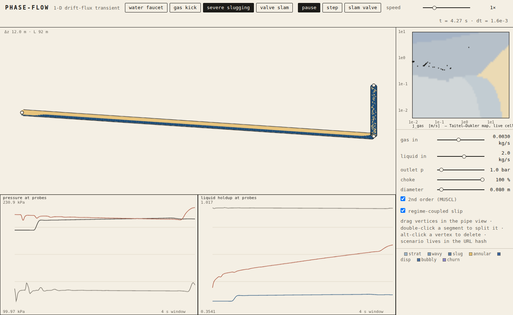

# phase-flow

[](https://github.com/benettia/PhaseFlow/actions/workflows/ci.yml)
[](https://github.com/benettia/PhaseFlow/actions/workflows/deploy.yml)

**▶ Play with it live: [benettia.github.io/PhaseFlow](https://benettia.github.io/PhaseFlow/)**

**A transient multiphase pipe flow simulator that runs live in the browser.**
Gas and liquid flow through a pipe you draw, solved by a real 1-D drift-flux
model — the same class of model that OLGA and nuclear thermal-hydraulics codes
run, small enough to be honest. Draw a dip before a riser, set low rates, and
watch the system discover severe slugging by itself: the four-stage limit
cycle (buildup → production → blowout → fallback) emerges from the equations,
not from scripting.



The heavy math is Rust (compiled to WebAssembly for the browser and to a
native extension for Python); the panel is plain ES modules + canvas; the
verification and analysis tooling is Python under `uv`.

---

## Quickstart

```sh
# 1. web app: build the wasm pkg once, then serve statically
wasm-pack build crates/wasm --target web --release --out-dir ../../web/pkg
python3 -m http.server -d web 8000        # → http://localhost:8000

# 2. solver test suite (fast: unit invariants + acceptance)
cargo test -p phase-core --release

# 3. python env — builds the maturin bindings and pulls analysis deps
uv sync

# 4. full verification suite (plots + assertions, ~1 min)
uv run pytest
```

Prerequisites: Rust stable with the `wasm32-unknown-unknown` target,
[`wasm-pack`](https://rustwasm.github.io/wasm-pack/), [`uv`](https://docs.astral.sh/uv/).
Zero runtime deps in the web app; Playwright (via uv) is the one browser dev-dep.

## Repository layout

| path | what | notes |
| --- | --- | --- |
| `crates/core` | the solver | `#![forbid(unsafe_code)]`, **zero dependencies**, f64 everywhere, no `mul_add` |
| `crates/scenario` | JSON ⇄ `Scenario` | serde lives here so core stays dep-free; shared by both wrappers |
| `crates/wasm` | wasm-bindgen wrapper | `new WasmSim(scenario_json)`, `step(dt_ms)`, `Float64Array` views straight into wasm memory (no copies) |
| `bindings/python` | pyo3 + maturin | `import phase_flow` → `Sim.from_json(...)`, numpy arrays out (safe copies, never aliased mutable), typed `.pyi` stubs |
| `web/` | index.html + canvas + controls | no framework, no bundler beyond wasm-pack output |
| `analysis/` | uv-run Python | verification plots, convergence studies, cycle analysis; every plot regenerable from `uv run analysis/<name>.py`; doubles as the pytest suite |

## The model

Drift-flux. Three conserved fields per cell, plus a fourth when the energy
equation is switched on — `U = [m_g, m_l, I, e]` (phase masses, mixture
momentum, mixture internal energy):

```
∂t(α_g ρ_g) + ∂x(α_g ρ_g v_g)                     = 0
∂t(α_l ρ_l) + ∂x(α_l ρ_l v_l)                     = 0
∂t(I)       + ∂x(α_g ρ_g v_g² + α_l ρ_l v_l² + p) = −ρ_m g sinθ − F_w
∂t(e)       + ∂x(Σ m_k v_k h_k)                   = j ∂x p + F_w v_m + 4U/D (T_a − T)
```

Closures:

- **Fluid properties are data, not constants** (`fluid::Fluid`): molar mass and
  Z for the gas, density / sound speed / thermal expansion for the liquid,
  both viscosities, both heat capacities, surface tension. Three named pairs
  ship — `air-water` (15 °C), `gas-oil` (40 °C), `gas-condensate` (60 °C) —
  and any single property can be overridden in the scenario JSON. Wall
  roughness is a *pipe* property and lives on the segment.
- **EOS** — gas `ρ_g = p/(Z R_s T)`; liquid weakly compressible and thermally
  expanding, `ρ_l = ρ_l,ref(1 − β ΔT) + (p − p_ref)/a_l²`. Two honest
  limitations: Z is constant, so the gas is enthalpy-ideal and there is **no
  Joule–Thomson cooling** (expansion cooling comes from the p dV work term,
  which is the dominant effect in a blowdown); and there is no mass transfer
  between the phases — no flashing, no condensation.
- **Energy** — *internal* energy, not total. Temperature has to be recoverable
  before the velocities are (density needs T, and the velocity solve needs
  density), and `T = T_ref + e/Σ m_k c_v,k` is explicit, which keeps the
  pressure inversion a closed-form quadratic and the iteration counts fixed.
  The cost is that `p div(j)` appears as a source rather than inside the flux,
  so the thermal field is not shock-capturing to machine accuracy. Off by
  default: the exact-solution verification cases are posed isothermally.
- **Primitive recovery** — p from (m_g, m_l, T) is a closed-form quadratic
  (exact for this EOS pair — temperature only moves two coefficients) plus two
  fixed Newton polish iterations. Isolated in `eos::pressure_from_masses`,
  round-trip tested across three fluids × five pressures × four temperatures ×
  six void fractions — this is where NaNs would breed, so it is fenced.
- **Slip law** (this closes the system) — Zuber–Findlay `v_g = C0·j + v_d`
  with `C0 = 1 + 0.2(1−α²)²`: ≈1.2 in bubbly/slug, → 1.0 as α_g → 1 *fast
  enough* that the single-phase limits are exact (the exponent matters — see
  CLAUDE.md). `v_d` is Harmathy rise velocity scaled by sinθ buoyancy and
  damped by (1−α).
- **Wall friction** — Darcy–Weisbach on the mixture with Churchill f(Re):
  laminar → turbulent in one formula, no branching. Verified against the
  textbook result in the single-phase limit (`report_dp_split_closes`).
- **Flow-regime classifier** (`regime.rs`, pure, closed-form + one bisection)
  — near-horizontal: Taitel–Dukler 1976 mechanistic transitions from the
  equilibrium stratified level + Kelvin–Helmholtz criterion (stratified
  smooth/wavy, intermittent, annular, dispersed bubble); steep pipes
  (|sinθ| > 0.6): void-fraction thresholds bubbly → slug → churn → annular.
  The regime feeds the renderer per cell, and — behind the `regime_feedback`
  flag, **default off** — modulates C0 so stratified gas lags the mixture.
  That coupling is what lets gas accumulate in a downhill line: the buildup
  phase of severe slugging.

## Numerics

Finite volume, uniform Δx per segment, SoA `Vec<f64>`. AUSMV flux splitting
(Evje–Fjelde) with van Leer velocity/pressure splittings on the **Wood
mixture sound speed** (computed, not assumed — it dips to ~20 m/s at
intermediate void). Sources (gravity, friction, area change) pointwise.
First-order, or MUSCL + MC limiter, flag-switchable at runtime — the
comparison is a demo. Explicit RK2 (Heun); Δt from CFL 0.5 on max|v| + a_m,
or a fixed Δt for bit-deterministic trajectories. α is clamped to [ε, 1−ε]
during primitive recovery only (conserved masses are never touched, so
conservation is exact). A NaN anywhere stops the sim and names the cell —
garbage is never rendered.

## Verification & acceptance

| test | where | result |
| --- | --- | --- |
| Ransom water faucet vs analytic, t = 0.5 s | `analysis/faucet.py` + cargo | L1 = 0.062, interior self-convergence order 0.80 |
| pure-gas shock tube vs exact isothermal Riemann | `analysis/shock_tube.py` + cargo | shock speed within 1 % of exact |
| mass conservation, closed ends, 1000 steps | cargo | ≤ 1e-12 relative, each phase |
| **steady ΔP split vs Darcy–Weisbach and ρgL** | cargo | friction within 5 %, static column within 2 %, acceleration term < 5 % |
| **wall heat transfer vs lumped exponential** | `analysis/thermal.py` + cargo | max error 0.000 % of the span |
| **frictional heating vs Δp/(ρ c_p)** | `analysis/thermal.py` | 0.1758 K vs 0.1765 K exact (0.4 %) |
| **blowdown cooling vs the isentrope** | `analysis/thermal.py` + cargo | 70 → 1 bar, 29 → −130 °C against −135 °C isentropic (never colder) |
| severe slugging limit cycle, unscripted | `analysis/slugging.py` | periods 165.0 / 165.6 s (±0.4 %), 91 kPa swing |
| gas kick: migration, expansion, unloading | `analysis/gas_kick.py` | front accelerates 1.05 → 1.50 m/s as gas expands; column unloads to < 1 % liquid |
| valve slam wave speed vs Wood a_m | `analysis/valve_slam.py` | within 15 % of the Wood mixture speed |
| fixed-dt bit determinism | cargo | exact `f64::to_bits` equality run-to-run |
| timeline rollback exactness | cargo | restoring a snapshot (energy field included) reproduces the continuation bit-for-bit under adaptive CFL |
| web boot, tabs, fluid switch, thermal toggle, CSV, rollback, all six presets | `analysis/smoke_web.py` | zero console errors, headless chromium |

Honest caveats, on the record:

- **The faucet has a model floor.** A strict drift-flux model cannot match
  Ransom's two-fluid analytic solution exactly: pressure information travels
  at the Wood speed (~25 m/s at α = 0.2), so the column cannot stay isobaric
  the way the analytic solution assumes. L1 ≈ 0.06 is that floor, not loose
  numerics; `analysis/out/faucet.png` shows the side-by-side. The faucet
  inlet is a pressure-anchored gas *make-up* feed (an open faucet top).
- **Determinism is per build target.** Same URL hash → bit-identical
  trajectory in fixed-dt mode on a given build; native vs wasm differ in the
  last ulp through libm (`ln`, `powf`).
- **No Joule–Thomson, no mass transfer.** A constant-Z gas has zero JT
  coefficient by construction, so throttling across the choke is isothermal in
  this model; blowdown cooling is real (p dV work) but the pipe wall's own
  thermal mass is not modelled, so early cooling rates are an upper bound.
  The phases never exchange mass.

## The panel

- **Pipe view** — rendered along its true geometry, each cell filled by
  regime. Stratified runs are drawn as one continuous liquid body with a real
  free surface that steps and ripples along the pipe; slug flow draws a
  Taylor-bubble/slug train; bubbly stipples at density ∝ α; annular draws a
  gas core inside a rippling wall film. Every pattern is phased on absolute
  position along the pipe and advected by the local phase velocity, so
  structures travel and stay continuous across cells. Stylized, but driven by
  α and regime — never faked.
- **Timeline** — the run is recorded frame by frame (conserved state plus
  display fields, on a fixed memory budget). Scrub back and the pipe, both
  strip charts and the regime map all move to that instant together. Press
  run from a rewound point and the solver is **rolled back exactly** to it
  (`Sim::load_state`, verified bit-identical by test) and continues from
  there — so you can rewind to just before a slug, change the choke, and
  replay the same instant down a different branch. ⏮ ◀ ▶ ⏭ , space to
  run/pause, ←/→ to step frames (shift for ×10).
- **Editor** — drag vertices to reshape the pipe; double-click a segment to
  split it; alt-click a vertex to delete it; diameter slider. Elevation
  profile is the whole game.
- **Strip charts** — pressure and holdup at three probes (10 % of length,
  riser base = minimum elevation, 95 %), read straight from the recording so
  they can never disagree with the pipe view, with a playhead marking the
  instant on screen. Probe markers are drawn on the pipe and on the map in
  matching colours.
- **Taitel–Dukler map** — the classifier's own transition boundaries with
  named regions, live per-cell dots migrating as the transient evolves.
- **Profiles** — pressure, liquid holdup, phase velocities and (with the
  energy equation on) temperature, stacked on one shared distance axis with
  segment boundaries marked and a hover cursor that reads every panel at once.
  This is the view you size a line from.
- **Design report** — the pressure drop split into friction / elevation /
  acceleration with a stacked bar, liquid and gas inventory, mean holdup,
  boundary mass rates with a steady/unsteady flag, the API RP 14E erosional
  velocity ratio, the minimum mixture sound speed (which sets the surge
  pressure), and the pressure and temperature ranges. Read straight from
  `Sim::report()`, so it is the same arithmetic the tests assert on, and it
  follows the playhead when you scrub.
- **Controls** — fluid pair and its properties, the energy equation with feed
  and ambient temperature and a wall U-value, sim speed (¼×–128×), gas/liquid
  inflow, outlet pressure, choke opening, diameter, roughness, "slam valve"
  (closes the choke in 0.1 s), "run to steady" (runs fast until inventory and
  boundary rates stop moving), CSV export of the current profile, and the
  first/second-order and regime-coupled-slip toggles. The whole scenario
  serializes to the URL hash.
- **Presets** — *water faucet* (verification), *gas kick* (bottom-injected
  gas migrates, expands, unloads the column), *severe slugging* (the
  flagship), *valve slam* (water-hammer at two-phase sound speed), *wet gas
  line* (1.8 km buried export line over rolling terrain, condensate in the
  dips, gas cooling toward ground temperature), *blowdown* (insulated gas
  line venting, the transient that sets minimum design metal temperature).

Aesthetic: engineering instrument. Cream ground, ink lines, one accent per
phase — pale amber gas, deep blue liquid.

## Development

See **[CLAUDE.md](CLAUDE.md)** for the working agreement: build/rebuild
chains, invariants that must not be broken, hard-won pitfalls, and the
changelog discipline (every PR updates CLAUDE.md — CI enforces it).

```sh
# one-time
uv sync && uv run pre-commit install    # ruff check+format, rustfmt, hygiene hooks

# after editing crates/core, in this order:
cargo test -p phase-core --release                                  # fast gate
wasm-pack build crates/wasm --target web --release --out-dir ../../web/pkg
uv sync --reinstall-package phase-flow                              # rebuild py bindings
uv run pytest                                                       # full verification
```

CI (`.github/workflows/ci.yml`) runs on every push/PR: `cargo fmt --check`,
`clippy -D warnings`, the solver tests, a wasm-pack build, ruff, and the full
pytest verification suite (including the headless-chromium smoke). PRs
additionally require a CLAUDE.md changelog entry. Pushes to `main` deploy
`web/` to GitHub Pages (`.github/workflows/deploy.yml`; set Pages → "GitHub
Actions" in the repo settings once).

## License

MIT — see [LICENSE](LICENSE).
